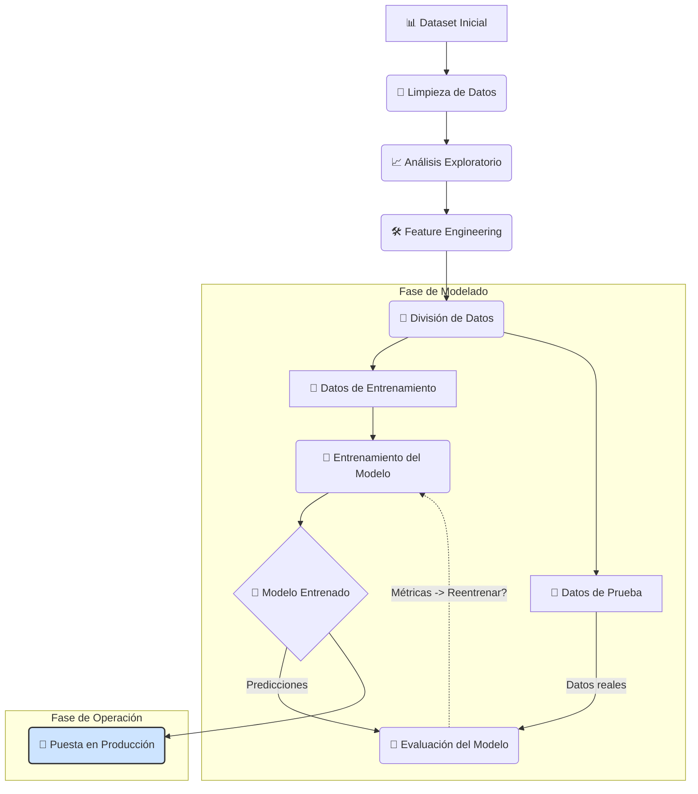

# Proyecto de Aprendizaje Supervisado: Supervivencia en el Titanic

[](https://www.hybridge.education)

### Ingeniería en Inteligencia Artificial - Clase de Inteligencia Artificial

Este repositorio documenta el proceso completo de un proyecto de aprendizaje supervisado, utilizando el famoso conjunto de datos del Titanic. El objetivo principal es aplicar los conceptos y metodologías fundamentales de la Inteligencia Artificial y el Machine Learning para predecir si un pasajero sobrevivió o no al desastre.

> Fecha de Finalización: **23 de Septiembre del 2025**.

## 🚀 Flujo de Trabajo en Aprendizaje Supervisado

El proyecto sigue un flujo de trabajo estructurado que abarca desde la preparación inicial de los datos hasta la puesta en producción de un modelo predictivo. A continuación se presenta un diagrama que ilustra este proceso, seguido de una explicación detallada de cada etapa.



### 📚 Conceptos Clave y Etapas del Proyecto

#### 2.1 Limpieza de Datos

- **Concepto:** Es el proceso fundamental de identificar y corregir (o eliminar) errores, inconsistencias y valores faltantes en un conjunto de datos. La calidad de un modelo de Machine Learning depende directamente de la calidad de los datos con los que se entrena, por lo que este paso es crucial para garantizar la fiabilidad de las predicciones.
    
- **Aplicación en el proyecto (`1_clean.ipynb`):** Se manejaron valores nulos en columnas críticas como `Age` y `Cabin`, se corrigieron tipos de datos y se eliminaron columnas que no aportaban información relevante para el modelo.
    

#### 2.2 Análisis Exploratorio de Datos (EDA)

- **Concepto:** Consiste en analizar y visualizar los datos para descubrir patrones, anomalías, probar hipótesis y entender las relaciones entre las distintas variables. El EDA nos permite obtener una intuición profunda sobre el dataset antes de construir el modelo.
    
- **Aplicación en el proyecto (`2_EDA.ipynb`):** Se generaron visualizaciones para entender cómo variables como la clase del pasajero (`Pclass`), el sexo (`Sex`) y la tarifa (`Fare`) se correlacionaban con la probabilidad de supervivencia (`Survived`).
    

#### 2.3 Feature Engineering

- **Concepto:** Es el proceso de utilizar el conocimiento del dominio para transformar variables existentes o crear nuevas (features) que mejoren el rendimiento del modelo. El objetivo es presentar la información de una manera que sea más fácil de entender para los algoritmos de aprendizaje.
    
- **Aplicación en el proyecto (`3_feature_engineering.ipynb`):** Se convirtieron variables categóricas (como `Sex` y `Embarked`) en representaciones numéricas mediante técnicas como _One-Hot Encoding_, permitiendo que el modelo las procese correctamente.
    

#### 2.4 Machine Learning

- **Concepto:** En esta fase se seleccionan, entrenan y evalúan diferentes algoritmos. Los datos se dividen en conjuntos de **entrenamiento** (para enseñar al modelo) y de **prueba** (para medir su rendimiento en datos no vistos). Este enfoque es clave para construir un modelo que generalice bien y evite el sobreajuste (overfitting).
    
- **Aplicación en el proyecto (`4_machine_learning.ipynb`):** Se entrenó un modelo de clasificación (Random Forest) para predecir la supervivencia y se evaluó su precisión y otras métricas de rendimiento.
    

#### 2.5 Puesta en Producción

- **Concepto:** Se refiere al proceso de desplegar un modelo entrenado en un entorno real donde pueda recibir nuevos datos de entrada y devolver predicciones de forma automática. Esto permite que el modelo aporte valor al ser utilizado por aplicaciones, usuarios finales u otros sistemas.
    
- **Aplicación en el proyecto (`app.py`):** Se desarrolló una aplicación web simple utilizando **Flask** que carga el modelo entrenado y permite a un usuario introducir las características de un pasajero para obtener una predicción de supervivencia en tiempo real.
    

#### 2.6 Pipelines

- **Concepto:** Un pipeline en Machine Learning es una herramienta que permite automatizar y encapsular todo el flujo de trabajo. Encadena múltiples pasos (como el preprocesamiento de datos y el entrenamiento del modelo) en un único objeto, asegurando consistencia y reproducibilidad.
    
- **Aplicación en el proyecto (`5_pipeline.ipynb`, `pipeline.pkl`):** Se construyó un pipeline para consolidar todos los pasos de transformación de datos y el estimador final. Esto simplifica enormemente el proceso de hacer predicciones en producción.
    

#### 2.7 Entrega

- **Concepto:** Es la culminación del proyecto, donde se presenta una solución funcional junto con toda la documentación, código y resultados. Una buena entrega demuestra que se han cumplido los objetivos planteados y que la solución es robusta y utilizable.
    
- **Aplicación en el proyecto:** Este repositorio de GitHub, con sus notebooks, código de la aplicación, modelos guardados y este `README.md`, constituye la entrega final del proyecto.
    

### 📂 Estructura del Repositorio

- `data/`: Contiene los conjuntos de datos originales, limpios y procesados.
    
- `1_clean.ipynb` a `5_pipeline.ipynb`: Jupyter Notebooks que detallan cada paso del proceso de Machine Learning.
    
- `app.py`: Aplicación web desarrollada con Flask para interactuar con el modelo.
    
- `*.pkl`: Archivos serializados que contienen el pipeline y el modelo entrenado.
    
- `requirements.txt`: Lista de dependencias de Python necesarias para ejecutar el proyecto.
    

### ⚙️ ¿Cómo ejecutar el proyecto?

1. **Clonar el repositorio:**
    
    ```bash
    git clone [https://github.com/jesusvasquezjr3/Aprendizaje-Supervisado](https://github.com/jesusvasquezjr3/Aprendizaje-Supervisado)
    cd Aprendizaje-Supervisado
    ```
    
2. **Crear un entorno virtual e instalar dependencias:**
    
    ```bash
    python -m venv venv
    source venv/bin/activate  # En Windows: venv\Scripts\activate
    pip install -r requirements.txt
    ```
    
3. **Ejecutar la aplicación web:**
    
    ```bash
    python app.py
    ```
    
    Abre tu navegador y ve a `http://127.0.0.1:5000` para ver la aplicación en funcionamiento.
    
4. **Ingresar datos de prueba:**

    Usa la opción a tu conveniencia, esto es para ingresar datos de prueba para probar el modelo, ingresalos abriendo una nueva terminal diferente a donde se está ejecutando **Flask**. 

    *Puedes sustituir los valores por los de tu preferencia para probar el modelo*

    - Opción 1: Usar curl.exe directamente
    ```bash
    curl.exe -X POST http://127.0.0.1:5000/predecir -H "Content-Type: application/json" -d '{"input": [0,0,0,0,0,0,0]}'
    ```

    - Opción 2: Usar Invoke-WebRequest (sintaxis PowerShell)
    ```bash
    Invoke-WebRequest -Uri "http://127.0.0.1:5000/predecir" -Method POST -ContentType "application/json" -Body '{"input": [0,0,0,0,0,0,0]}'
    ```

    - Opción 3: Usar Invoke-RestMethod (más simple para APIs)
    ```bash
    Invoke-RestMethod -Uri "http://127.0.0.1:5000/predecir" -Method POST -ContentType "application/json" -Body '{"input": [0,0,0,0,0,0,0]}'
    ```


>[!Tip]
> **📥 Estructura del JSON de Entrada para Predicciones**
>
> Para realizar una predicción a través de la API, se debe enviar una solicitud `POST` al endpoint `/predict` con un JSON que contenga los datos del pasajero.
>
> El JSON debe ser un diccionario donde las claves son los nombres de las características (`features`) y los valores son **listas** que contienen los datos de cada pasajero. Esta estructura permite realizar predicciones para uno o varios pasajeros a la vez.
>
> **Ejemplo de JSON para un solo pasajero:**
>
>```json
> {
>    "Pclass": [3],
>    "Sex": ["male"],
>    "Age": [25],
>    "SibSp": [1],
>    "Parch": [0],
>    "Fare": [7.5],
>    "Embarked": ["S"]
> }
>```
>
> **Descripción de las claves:**
>
>- `Pclass`: Clase del ticket (1, 2, o 3).
>    
>- `Sex`: Género (`male` o `female`).
>    
>- `Age`: Edad en años (numérico).
>    
>- `SibSp`: Número de hermanos o cónyuges a bordo (numérico).
>    
>- `Parch`: Número de padres o hijos a bordo (numérico).
>    
>- `Fare`: Tarifa del pasaje (numérico).
>    
>- `Embarked`: Puerto de embarque (`C` = Cherbourg, `Q` = Queenstown, `S` = Southampton).

> ### ¿Cómo hacer las modificaciones al `input`?
> **Supongamos que quieres predecir la supervivencia de un hombre de 30 años, que viaja en 3ra clase, solo, pagó una tarifa de 8.05 y embarcó en Southampton (S).**
> El comando `curl` se vería así:
> ```bash
> curl.exe -X POST http://127.0.0.1:5000/predecir -H "Content-Type: application/json" -d '{"Pclass": [3], "Sex": ["male"], "Age": [30], "SibSp": [0], "Parch": [0], "Fare": [8.05], "Embarked": ["S"]}'
> ```
